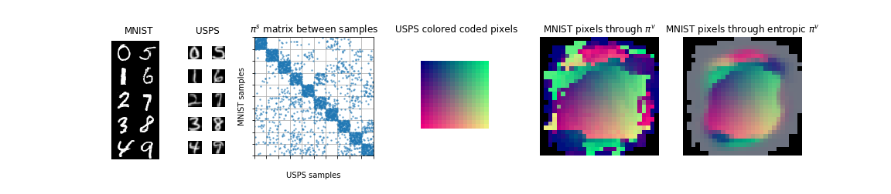
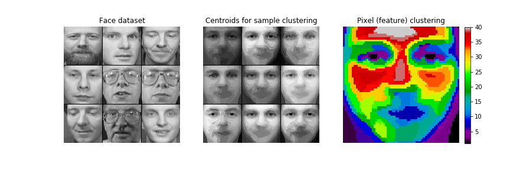

# COOT

Python3 implementation of the paper [CO-Optimal Transport](https://arxiv.org/abs/2002.03731) (NeurIPS 2020)

CO-Optimal Transport (COOT) is an Optimal Transport problem between measures whose supports do not necessarily live in the same metric space. It aims to simultaneously optimize two transport maps between both samples and features of two datasets with possibly different number of rows and columns.

Feel free to ask if any question.

If you use this toolbox in your research and find it useful, please cite COOT using the following bibtex reference:

```
@incollection{coot_2020,
title = {CO-Optimal Transport},
author = {Ievgen, Redko and Vayer, Titouan and Flamary, R\'{e}mi and Courty, Nicolas},
booktitle = {Advances in Neural Information Processing Systems 33},
year = {2020}
}
```

### Prerequisites

* Numpy (>= 1.11)
* Matplotlib (>= 1.5)
* For Optimal transport [Python Optimal Transport](https://pythonot.github.io/) POT (>=0.5.1)

### What is included ?

* The main function that computes the COOT problem between two datasets in the lib folder (file cot.py)

* Demo notebooks:
	- [coot_mnist.ipynb](./example/coot_mnist.ipynb): COOT on the MNIST/USPS problem



* Code to repoduce results of the paper in the expe folder.




### Authors
* [Ievgen Redko](https://ievred.github.io/)
* [Titouan Vayer](https://github.com/tvayer)
* [Rémi Flamary](https://github.com/rflamary)
* [Nicolas Courty](https://github.com/ncourty)